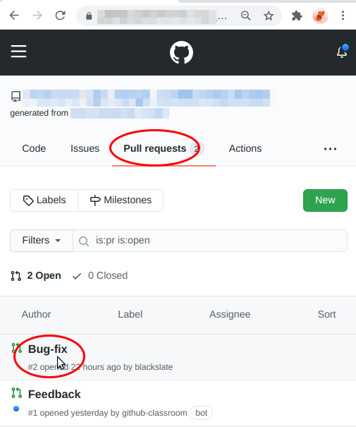
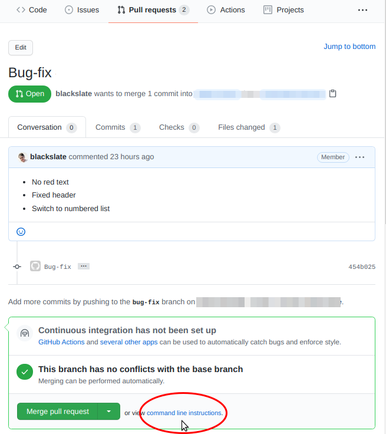
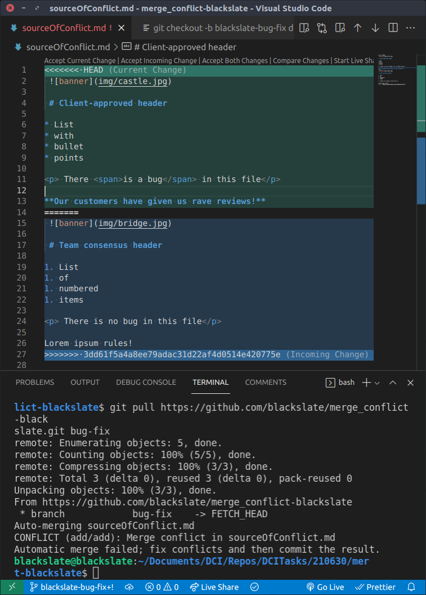

# Handling a Git Merge Conflict

In this exercise, you and a partner will make different changes to the same MarkDown document. This will generate a Merge Conflict, which you must then resolve.

### Please be sure to read [the context of this exercise](./Context.md) before you continue.

---
## Your Mission, if You Decide to Accept It...

This exercise will walk you through all the steps described above, and will deliberately create a merge conflict, that you must resolve.

This way, you will get experience in:

* The regular workflow of a project managed with GitHub
* Dealing with an unexpected issue calmly and professionally.

---
## Instructions

The exercise is in four parts, and there are two roles: owner and team member. You can work through the exercise twice: the first time, one of you will be the owner, the other will be the team member. The second time, you can switch roles.

You can take it in turns to share your screen with your partner, as you work on your specific part.

### Part 1: Working as an owner, making changes to `dev`

1. _You are be the owner of this GitHub repository. You will be the only person with admin rights to it. Only you can `push` to this repository._
2. Actually, that's not true. To simplify this exercise, your GitHub repository is public. This means that you don't have to go through an extra step of inviting contributors to join you and giving them read-only access rights. But let's pretend it's true while you do this exercise.
3. Clone this repository to your development computer. (Choose carefully which folder you use to hold your local repository.)
4. `cd` into your cloned repository
5. Open the repository folder in VS Code
   ```bash
   code -r .
   ```
   Or in plain English: "VS `code`, `-r`euse this window to open `.` (= this folder)"
6. Open a Terminal pane (`Ctrl-` `)
7. For technical reasons, the repository currently contains only a `main` branch. Start by creating a `dev` branch from the `main` branch:
   ```bash
   git checkout -b dev
   ```
   The `dev` branch should now be identical to the `main` branch.
8. Push the `dev` branch to your (owner's) GitHub repository:
   ```bash
   git push origin dev
   ```
9. Choose a partner
10. Give your partner a link to this GitHub repository. Copy the link from your browser's address bar. Your partner can now start to follow the **Working as a team member** steps below.

Imagine that you have spoken with the client, and that you are acting with authority. You are now going to create a new branch, make some changes, and test them locally.

11. Create a new branch called `client-requested-changes`
   ```
   git checkout -b client-requested-changes
   ```
12. Open the `sourceOfConflict.md` file. Notice that it contains a "bug" which will appear in red if you preview the MarkDown text.
13. Open a preview of the markdown file in VS Code. First split the editor pane (Ctrl-\) then show the preview (Ctrl-Shift-V). This will let you see the preview change as you update the `sourceOfConflict.md` file.
14. Provide a _cosmetic_ fix for the "bug" by removing the style from the span, so that it no longer appears red. But the bug is still there. It's just hidden. So don't change the text. It should look like this:
   ```html
   <p>There is a bug in this file.<p>
   ```
15. Make some other changes as you like. For example:
   * Choose a different banner image
   * Change the header
   * (Leave the list as it is)
   * Add a paragraph of text
16. Run `git status` to see which files have changed
17. Run `git diff` to see which files have been edited
18. Use `git add .` to add your changes to git's staging area
19. Use `git commit` to commit your changes (but read [this](https://github.com/DCIForks/E07/wiki/Good-git-commit-messages:-using-VS-Code-as-your-git-editor) first).
20. When writing the commit message:
   * Refer to the output of the `git status` and `git diff`
   * Create a short descriptive title
   * Provide details of all the changes that you have made as bullet points
   * Remember that you know the context of what you are writing, but other readers (including yourself in 3 weeks' time) will not know the context. So make your notes clear and detailed.

   For example, your commit message might look like this:
   ```markdown
   Apply client-requested changes

   * Alter banner image
   * Use text given by client for the header
   * Add paragraph provided by client
   ```
21. Run `git log` to check that your commit was correctly applied, and that your commit message is clear.
  > Git asks the [less](https://linuxize.com/post/less-command-in-linux/) utility to display log entries, and other data that may display over several lines or several pages.
  >* If you see a colon (`:`) in the last line in the Terminal window, this means "Press the space bar if you want to see more log entries."
  >* If you see `(END)` this means "There are no more log entries.
  >* At any time you can press `Shift-Q` to stop the less utility
  >* If all the information then suddenly disappears from the Terminal, run the [following command](https://serebrov.github.io/html/2014-01-04-git-log-and-less-keep-output.html) to stop it from disappearing in the future:
  >
  >   `git config --global --replace-all core.pager "less -iXFR"`
22. *Only if necessary* you can run `git commit -amend` to correct any mistakes in your commit message.

You should now have:
* The original `sourceOfConflict.md` file in `main`
* The original `sourceOfConflict.md` file in `dev`
* Your updated `sourceOfConflict.md` file in the new `client-requested-changes` branch.

Your work as owner is done, for now.

---
### Part 2: Working as a team member, making changes in a `bug-fix` branch
1. Visit the link to your partner's repository which they sent you in step 9 above.
2. Near the top left of the repository's main page, you should see a button named Fork. Click on this to create a fork of your partner's repository.
3. If given a choice of accounts to which to fork the repository, choose your own personal account.

   If your partner's repository is found at a URL like...
   [https://github.com/DCI_group/merge_conflict-owner]()
   ... then your fork should be created at a URL like:
   [https://github.com/your_name/merge_conflict-owner]()


A _fork_ is like a _clone_, but not exactly. Like a clone, it is an identical copy of the original repository. However, a fork will live on GitHub, while a clone lives on your local development computer.

You will have __read-write access_ to your fork, but only _read access_ to your partner's (owner's) repository*. This means that you cannot push any changes to the owner's repository. You need to fork it, so that you have your own copy of the repository, so that you can push your work to GitHub. As you will see, GitHub will then suggest that you create a _pull request_ for your partner to review.

\* *Actually, that's not true. To simplify this exercise, your GitHub repository is public. This means that you can skip some administrative steps. So you could push changes to the owner's GitHub repository. But let's pretend you can't while you do this exercise.*

1. Clone your fork to your development computer.

   **Choose carefully which folder you use to hold your local repository. In particular, do NOT put it inside the same folder as the repository for which you are the owner.**
2. Use `git remote -v` to check what remote Git repositories your local repository is connected to. (The `-v` means "verbose", which makes Git show the path as well as the name of the remote.) You should see something like:
   > ``` bash
   > origin    git@github.com:your_name/merge_conflict-owner.git (fetch)
   > origin    git@github.com:your_name/merge_conflict-owner.git (push)

   In other words, you should have a remote called `origin` which points to your GitHub fork on your personal GitHub account from which you cloned this local repository.

You now need to tell Git where the owner's original "source of truth" repository is. By convention, the name for a Git remote that _you_ own is `origin`. By convention, the name for the "source of truth" repository is `upstream`.

3. In your browser, visit the link that your partner sent you earlier (the page from which you forked your GitHub repository).
4. Click on the green Code button and copy the path that _would_ allow you to clone the repository (but don't clone it).
5. In the Terminal window for your local clone, run the following command:
   ```bash
   git remote add upstream <clone-link-that-you-just-copied>
   ```
   **Note that you should replace `<clone-link-that-you-just-copied>` with the actual link that you just copied, so your command might look like this:
   ```bash
   git remote add upstream git@github.com:DCI_group/merge_conflict-owner.git
   ```
6. Run `git remote -v` again. You should now see something like:

   > ``` bash
   > origin    git@github.com:your_name/merge_conflict-owner.git (fetch)
   > origin    git@github.com:your_name/merge_conflict-owner.git (push)
   > upstream      git@github.com:DCI_group/merge_conflict-owner.git (fetch)
   > upstream      git@github.com:DCI_group/merge_conflict-owner.git (push)


Imagine that you have spoken with the dev team, and that you have to make an important bug fix, and also make some minor changes. To do this, you are going to create a new branch based on the `dev` branch, and make your changes in that.

7. Check what branches you have locally. Run `git branch -v`. (The `-v` means `v`erbose, so Git will print out both the id and the title of the latest commit message for each branch.)
8. You are likely to see only a `main` branch. It might look something like this:
    ```bash
    * main cdd7c29 Initial commit
    ```
9.  To see all the branches that are available on your remote GitHub fork, run `git remote -r` (where `-r` means `r`emote). You should see something like this:
    ```bash
    origin/HEAD -> origin/main
    origin/dev
    origin/main
    ```
    Note that the `dev` branch was not visible when you ran `git remote -v`, because you had not yet checked it out locally.
10. Checkout the `dev` branch so that it is available locally: `git checkout dev`
11. Create a new branch with a name that describes the feature that you are planning to work on. You can give this branch any name you like but make sure that it is descriptive of the changes that you plan to make. I'll call it `bug-fix`. This will be based on your  current `dev` branch:

   `git checkout -b bug-fix dev`

__This command says: "`git`, please `checkout` a new `-b`ranch called `bug-fix` and copy the current contents of the `dev` branch into it, as the starting point"._

12. As the owner did above, make some changes to your local fork. You want to ensure that you generate a merge conflict later, so make sure that your changes are different from the owner's, but that some of them affect the same lines. For example:
   * To "fix" the bug, remove the `<p>` and the `span` tags along with the style. In other words, edit the text to...
     ```
     There is no bug in this file.
     ```
   * Leave the banner image as it is
   * Change the header
   * Change the list to a numbered list
13. Run `git diff` to see which files have been edited
14. Run `git status` to see which files have changed
15. Use `git add .` to add your changes to git's staging area
16. Use `git commit` to commit your changes (but read [this](https://github.com/DCIForks/E07/wiki/Good-git-commit-messages:-using-VS-Code-as-your-git-editor) first).
17. When writing the commit message:
   * Refer to the output of the `git status` and `git diff`
   * Create a short descriptive title
   * Provide details of all the changes that you have made as bullet points
   * Remember that you know the context of what you are writing, but other readers (including yourself in 3 weeks' time) will not know the context. So make your notes clear and detailed.

     For example, your commit message might look like this:
     ```markdown
     Fix bug, header and list type

     * Alter header as agreed with dev team
     * Change bullet list to number list
     * Fix bug
     ```

---
> This is currently the state of the project:
> * There are four repositories:
>   1. The owner's local repository on their development computer
>   2. The owner's authoritative repository on GitHub (`upstream`)
>   3. Your fork of the authoritative repository  on GitHub (`origin`)
>   4. Your local clone of the forked repository
>
> * The two repositories on GitHub (2, 3) share identical content
> * The owner's local repository (1) contains changes to the `client-requested-changes` branch
> * The owner's local repository (1) and your local repository (4) both contain both `main` and `dev` branches which are identical to the GitHub repositories' (2, 3)
> * Your local repository contains a new `bug-fix` branch.
> * Your `bug-fix` branch and the owner's `client-requested-changes` are different.
>
> The following steps will allow your `bug-fix` branch to travel first to your GitHub fork (3), then to the owner's GitHub repository (2), so that the owner can pull your changes to the repository on their development computer to test and review it.

---
1.  Push your changes to your fork:
   `git push origin bug-fix`
2. Go to your GitHub fork in your browser and click on the green Compare & Pull Request button that should have appeared.
3. If you don't see this button, do one of the following:
    * Refresh the page
    * Ensure that the Pull Requests tab is active
    * Ensure that the `bug-fix` branch is selected.
4.  Check that the automatically created message is meaningful, and if not, edit it. Add a personal note, if you want.
5.  Click on the green Create Pull Request button.
6.  GitHub will probably now take you to the page for the owner's repository.

> In a real project, you might in fact make a number of commits and push them all to your local fork before you make the Pull Request. This is why GitHub does not generate the Pull Request automatically, but waits until you are ready.

---
### Part 3: Working as the owner: reviewing the pull request
Owner, when you receive notification of the PR created by your team member:
1. Visit your repository on GitHub
2. Click on the Pull Request tab
3. Refresh the page if necessary
4. If there is a Feedback PR, you can ignore it: this would have been generated automatically by GitHub Classrooms, so that your mentors can provide you feedback on your work.
5. Click on the most recent pull request. Its name could be either the title that your team member used for the most recent commit message (e.g. "Fix bug, header and list type"), or a prettified version of the branch name (e.g. "Bug Fix").



> GitHub helpfully provides a big green Merge Pull Request button but **do NOT click on this**. This button allows you to merge the pull request directly in GitHub, but it does not give you the chance to test that everything is working correctly with the changes that you made locally earlier.
> The big green button is only useful for treating very minor changes that you can safely make directly to the `main` branch without any testing. Indeed, it would be probably be disabled for any changes that resulted in a conflict.
>
> Instead, click on the link to view `command line instructions` and review the lines of code for Step 1. These are designed to allow you to pull the proposed changes to your development computer, but they are not exactly what you need, so you will need to edit them.
> 
> The automatically generated code creates a new branch based on `main`, but you want to check that everything is compatible with your custom `client-requested-changes` branch.

6. Copy the first line of code for Step 1 **without the final `main` branch name** and paste it into the Terminal in VS Code. Press Enter to execute this command. It might look something like this:

   ```bash
   git checkout -b partner-bug-fix
   ```

   **Note**: This command will copy the current state of your `client-requested-changes` into a new branch. If the command fails, run `git status`, to check that you haven't made any changes since the last commit, and if you have, run `git add . && git commit` and write a meaningful commit message before you try executing the line of code that you just pasted again.

   **Note**: *Only if you **do*** include the `main` branch name by mistake, your new branch will be a copy of the unchanged `main` branch, with none of your changes. To fix this run:
   ```
   git merge client-requested-changes
   ```
7. Go back into your browser and copy the second line of code from Step 1 and paste it into the Terminal pane, then press Enter. This will pull the changes from your team member's feature branch. The command might look something like this:

   ```bash
   git pull https://github.com/partner/merge_conflict-owner.git bug-fix
   ```

   **Note**: `pull` is actually a shortcut for two Git commands: `fetch` followed by `merge`. The `fetch` command will get the data from your partner's feature branch on their GitHub fork repository; the `merge` command will do its best to apply all your partner's changes to your current branch.

## Merge Conflict!

As planned, this implicit `merge` command will fail. It fails because both you and your partner have made changes to the same lines of the same file.

> Depending on which version of Git you are working with, you may see the following warning:
>
> ```bash
> hint: You have divergent branches and need to specify how > to reconcile them.
> hint: You can do so by running one of the following > commands sometime before
> hint: your next pull:
> hint:
> hint:   git config pull.rebase false  # merge
> hint:   git config pull.rebase true   # rebase
> hint:   git config pull.ff only       # fast-forward only
> hint:
> hint: You can replace "git config" with "git config > --global" to set a default
> hint: preference for all repositories. You can also pass > --rebase, --no-rebase,
> hint: or --ff-only on the command line to override the > configured default per
> hint: invocation.
> fatal: Need to specify how to reconcile divergent branches.
> ```
>
> If this happens, copy the command `git config pull.rebase false  # merge` and execute it, then press the up arrow on your keyboard twice (to show the `git pull ... bug-fix` line again), and execute the pull request a second time.



1. In the VS Code editor, you should now see both your version and your collaborator's version, against a coloured background.
2. Just above the coloured zones, you will see a number links: [Accept current changes]() | [Accept incoming changes](), and so on. Click on one of these to see what happens. Press Ctrl-Z to undo your action and restore the Merge Conflict display.
3. Hold a meeting with your team member, to reach consensus on how to resolve this conflict.
4. Remember: you are the owner of this project. You have responsibility to the client. Your decision is final. You will need to:
   * Choose which incoming changes you want to accept
   * Choose which current changes you want to keep
   * Ensure that the three lines...
     ```
     <<<<<<< HEAD (Current Change)

     =======

     >>>>>>> longIdStringMadeOfRandomLettersAndNumbers (Incoming Change)
     ```
     ... are deleted.
5. When you are satisfied, commit your changes. You will see an automatically generated message.
   > Question: Why is it red? Why should you not use this exactly as it stands?
   >
   > Answer: In a commit message, you should:
   > * Create a short descriptive title
   > * Provide details of all the changes that you have made
   > If the first line (the short descriptive title) is more than 50 characters long, VS Code will helpfully display it in red, to warn you that it is too long. (You _can_ ignore this warning if you want.)

---
The custom branch that you have just created (`partner-bug-fix`) now holds the most up-to-date version of your project. Now you need to share this with all your team members, so that they can synchronize their work with yours.

6.  Checkout the `dev` branch
7.  Merge the changes from the custom branch you were just working on. Your Git command might look something like this:
    ```bash
    git merge --no-ff partner-bug-fix
    ```
    * `--no-ff` means `no f`ast `f`orward. This tells Git to work safely and to show errors if there is any difficulty with the merge.
8.  This will prompt Git to open a new commit message for the merge with an automatically generated title. You can repeat the details of the latest changes if you want.
9.  Push the updated `dev` branch to your GitHub repository
    `git push origin dev`
10. Ask your team member to pull the changes from the `dev` branch.

---
### Part 4: Working as team member, updating your repositories
When you receive notification from the owner that the `dev` branch has been updated:
1. Checkout the `dev` branch. The sourceOfConflict.md file will still contain the original content.
2. Run `git pull upstream dev`
3. Check that everything in sourceOfConflict.md looks the way you expected after your discussions with the owner. If not, go through this cycle again.
4. Finally, push the updated version of your `dev` branch to your GitHub repository.

> Now, all 4 repositories should be in the same state. In all the repositories...
>
>   1. The owner's local repository on their development computer should have the original `main` branch still unchanged
>   2. The owner's authoritative repository on GitHub (`upstream`)
>   3. Your fork on GitHub of the authoritative repository (`origin`)
>   4. Your local clone of the forked repository
>
> ... the `main` branch will be unchanged, and the `dev` branch will have been updated.

The only differences will be that the owner's local repository will have two custom branches...
* `client-requested-changes`
* `partner-bug-fix`
... and the team member's local repository and GitHub fork will have one custom branch:
* `bug-fix`

If all is well, these branches will have outlived their usefulness and you can now delete them:

5. If you are the owner, you can run:
   ```bash
   git branch -D client-requested-changes partner-bug-fix
   ```
6. If you are the team member, you can run:
   ```bash
   git branch -D bug-fix
   git push origin --delete bug-fix
   ```
   * The `-D` directive says "delete this branch even if it is unmerged". The second command deletes the `bug-fix` branch on the remote `origin` repository on GitHub.

You are now ready to start a new cycle of development. This would start with checking out a new branch with a different custom name, describing the next feature you want to work on.

## A New Release

When everyone on the team is satisfied that the `dev` branch is ready to be released to end-users, the owner can run `git checkout main && git merge dev && git push origin main` on their local computer. This will update `main` locally and push it to the "source of truth" GitHub repository.

Now all the other team members can run `git checkout main && git pull upstream main && git push origin main && git checkout dev && git merge main`. This will...

* Pull the latest version of `main` to their local computers
* Synchronize `main` on their remote GitHub forks
* Make `dev` locally identical to the current `main`

... ready to begin work on the next version.
